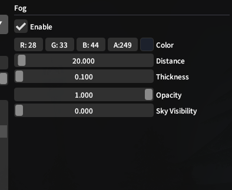
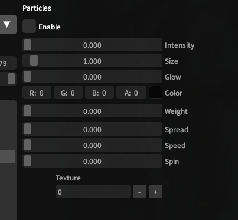
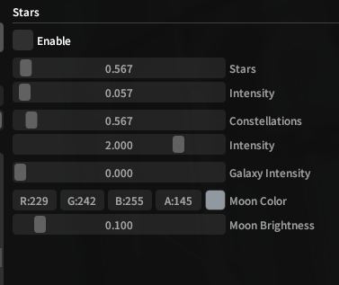

# Environment Editor

At any time during posing, the **Environment Editor** allows you to temporarily change the surrounding world state in a variety of ways. These changes will be reverted to the true state when exiting GPose.

Weather can be modified freely with the main dropdown from choices available to your current zone, while Time & Day + Date require freezing time using the Lock button.

???+ note

    A number of sliders and toggles in the **Environment Editor** may be marked as *unknown*. This means that while we can access and change the data FFXIV is using for these variables, we may not be sure of their meaning, effects, or utility. We still offer these options so that users can experiment with all the tools available, and hopefully contribute naming for them in the future!

## Sky

{ align=right width=300 }
Ktisis can replace the zone's skybox with any number of vanilla options - most of these are simple gradients or solid colors, which can lead to interesting effects. Similarly, Top-Cloud and Side-Cloud textures can be changed, along with their cloud and shadow colors.

Cloud textures use transparent normal maps, meaning that their look ingame will be driven primarily by Shadow color, with Cloud color acting as a highlight for the 'brighter' sections of each image. The Shadows slider increases their normal intensity, and the Side Height slider stretches them up and down along the skybox as if it were a dome.

## Light

{ align=right width=300 }
The Light editor can modify the brightness, intensity, and colors of any kinds of global lighting currently affecting the scene. In a typical zone, during the Eorzean daytime the Sunlight color will be applied, with nighttime using the Moonlight color.

Saturation and Temperature are the only known values from vanilla here - Unknown 2 may have an effect on shadows/reflectivity, and Unknown 3 seems to apply a darkening radius ala an eclipse or sun-setting on the horizon.

## Fog

{ align=right width=300 }
The Fog editor handles a fog effect that is applied to the camera during foggy weather conditions, but can be enabled to be used during any weather for GPose.

Distance controls how far-out from the camera's position the fog should begin to thicken, with Thickness affecting the rate of growth and overall intensity based on how far objects are from view. Opacity acts as a blend between the background skybox colors and the fog color set above, and Sky Visibility lets the entities in the skybox appear clearly regardless of fog intensity (sun, moon, stars and clouds - though this has no effect on brightness).

## Rain

{ align=right width=300 }
"Lorem ipsum dolor sit amet, consectetur adipiscing elit, sed do eiusmod tempor incididunt ut labore et dolore magna aliqua. Ut enim ad minim veniam, quis nostrud exercitation ullamco laboris nisi ut aliquip ex ea commodo consequat. Duis aute irure dolor in reprehenderit in voluptate velit esse cillum dolore eu fugiat nulla pariatur. Excepteur sint occaecat cupidatat non proident, sunt in culpa qui officia deserunt mollit anim id est laborum."

## Particles

{ align=right width=300 }
"Lorem ipsum dolor sit amet, consectetur adipiscing elit, sed do eiusmod tempor incididunt ut labore et dolore magna aliqua. Ut enim ad minim veniam, quis nostrud exercitation ullamco laboris nisi ut aliquip ex ea commodo consequat. Duis aute irure dolor in reprehenderit in voluptate velit esse cillum dolore eu fugiat nulla pariatur. Excepteur sint occaecat cupidatat non proident, sunt in culpa qui officia deserunt mollit anim id est laborum."

## Stars

{ align=right width=300 }
"Lorem ipsum dolor sit amet, consectetur adipiscing elit, sed do eiusmod tempor incididunt ut labore et dolore magna aliqua. Ut enim ad minim veniam, quis nostrud exercitation ullamco laboris nisi ut aliquip ex ea commodo consequat. Duis aute irure dolor in reprehenderit in voluptate velit esse cillum dolore eu fugiat nulla pariatur. Excepteur sint occaecat cupidatat non proident, sunt in culpa qui officia deserunt mollit anim id est laborum."

## Wind

Todo (simple, no image needed)

## Water

Todo (simple, no image needed)